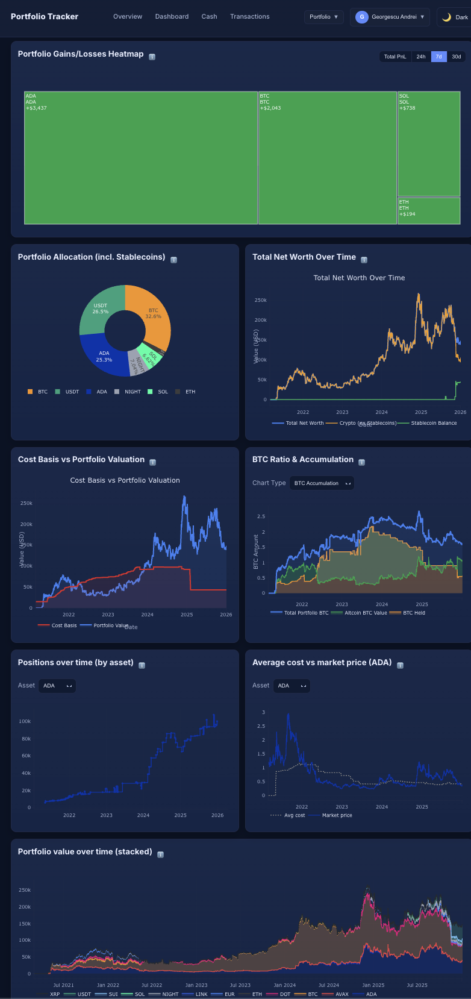

# Portfolio Tracker (Crypto)

A modern, self-hostable crypto portfolio tracker built with **Next.js + Prisma (SQLite)**.

- **Live app**: https://crypto-portofolio.com/

## What it does (capabilities)

- **Multi-portfolio support**: track multiple wallets/accounts/strategies under one login.
- **Transactions ledger**: log **Buy / Sell / Deposit / Withdrawal** events with timestamps, quantities, fees, and notes.
- **Portfolio overview & dashboards**:
  - holdings table
  - allocation and performance visuals
  - portfolio summaries across time
- **Price data**:
  - current prices for tracked assets
  - historical price series for charts
- **Import / export**:
  - export transactions to CSV
  - import transactions from CSV (including a TradingView-friendly format)
- **Romania tax reporting**:
  - compute taxable events
  - export detailed CSV reports
  - configurable lot strategies (**FIFO/LIFO/HIFO/LOFO**) for assets and cash
- **Authentication**:
  - email (magic link) + optional password setup
  - Google OAuth
  - credentials login (email verification enforced)

## Examples (high level)

Typical workflows:

- **Start tracking**:
  - Create an account → create a portfolio → add a few buys/sells/deposits/withdrawals → review holdings & allocation.
- **Bootstrap from history**:
  - Import a CSV (or TradingView export) → validate assets → see your portfolio overview update.
- **Tax time (Romania)**:
  - Select year + portfolio + lot strategies → generate report → export CSV for reconciliation.

## Screenshot (example layout)



## Tech stack (high level)

- **Next.js (App Router)** UI + API routes
- **Prisma + SQLite** persistence (simple single-file DB, easy to self-host)
- **NextAuth** for auth providers and sessions
- **SWR** for responsive, cached data fetching
- **Plotly** chart components

## Run locally (development)

```bash
npm install
npm run db:generate
npm run dev
```

Open `http://localhost:3000`.

## Docker (recommended for self-hosting)

```bash
cp env.production.example .env.production
# edit .env.production with real secrets/keys
docker compose build
docker compose up -d
```

Notes:
- Docker runs the app on **port 3033** (mapped to `http://localhost:3033`).
- The SQLite DB is stored at `/data/dev.db` in the container and persisted via the `./prisma` volume mount.

## CI/CD

The project uses GitHub Actions for continuous integration and deployment.

### CI (automatic)

Every push to `main` and every pull request runs **lint + build** checks. No setup required — this works out of the box.

### CD (deploy on tag or branch push)

Pushing a version tag or to the `production` branch triggers a full deployment pipeline:

1. Lint + build check
2. Docker image build and push to [GitHub Container Registry](https://ghcr.io)
3. SSH into your production server to pull the new image and restart

**Trigger a deploy:**

```bash
# Option A: tag a release
git tag v1.0.0
git push origin v1.0.0

# Option B: push to production branch
git push origin main:production
```

> `GITHUB_TOKEN` is provided automatically by GitHub Actions — no manual setup needed.

**How it works:** GitHub Actions builds the image and pushes it to GHCR. On the server, [Watchtower](https://containrrr.dev/watchtower/) polls GHCR every 5 minutes and automatically pulls + restarts when a new image is detected. No SSH, webhooks, or inbound ports needed.

**Server setup (one-time):**

```bash
# 1. Log in to GHCR so Watchtower can pull images
docker login ghcr.io -u YOUR_GITHUB_USERNAME

# 2. Start the app + Watchtower
docker compose up -d
```

That's it. Future deploys happen automatically when you push a tag.

## Configuration

See `env.production.example` for the expected environment variables (notably `NEXTAUTH_URL`, `NEXTAUTH_SECRET`, `DATABASE_URL`, and OAuth/email provider settings).
